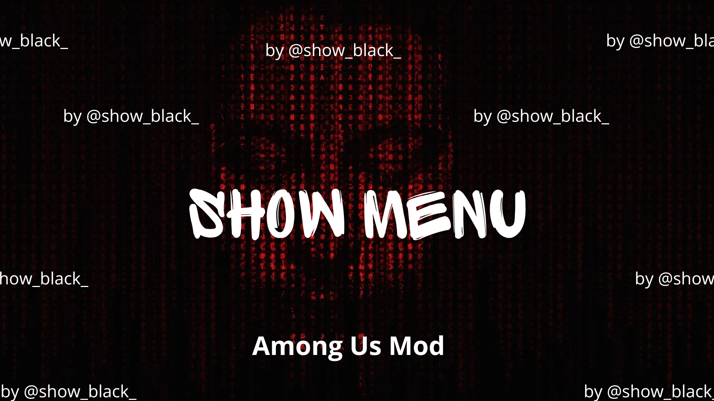

ShowMenu by Showblack
  

  
  
  
  

   

<b>An easy-to-use Among Us cheat menu with a simple GUI and lots of useful modules. </b>

# 😎 Table Of Contents
- [🎁 Releases](#-releases)
- [⬇️ Installation](#️-installation)
- [📋 Features](#-features)
- [❓ FAQ](#-faq)
- [⚠️ Disclaimer](#️-disclaimer)

# 🎁 Releases
| Mod Version| Among Us - Version | Link |
|----------|-------------|-----------------|
| v0.0.1 | 2024.9.4 | [Download](https://github.com/showblack9/showmenu/releases/download/v0.0.1/ShowMenu-0.0.1.zip) |

# ⬇️ Installation

1. Download the latest **ShowMenu zip pack** from [here](https://github.com/showblack9/showmenu/releases/latest).
    - **For Steam, Epic Launcher, and Itch.io:** Download `ShowMenu-VERSION.zip`.
    - **For Microsoft Store:** Download `ShowMenu-VERSION-Microsoft.zip`.

2. Open the zip file you have just downloaded and copy all its contents.

3. Paste these files directly into your Among Us game folder:
    - **Steam:** Right-click Among Us in your Library → Click `Manage` → Click `Browse local files`.
    - **Epic Launcher:** Right-click Among Us in your Library → Click `Manage` → Click the folder icon in the `Installation` box.
    - **Itch.io:** Open the Itch.io app → Right-click Among Us in your Library → Click `Manage` → Click `Open folder in Explorer`.
    - **Microsoft Store:** Open the location where Among Us is installed (usually under `C:\Program Files\WindowsApps\` or another default path depending on your installation).

4. Launch Among Us as you normally would. You should see a console window appear, installing the mod's requirements.

5. Wait for the console window to finish the installation.

6. After installation, Among Us will automatically open with ShowMenu successfully installed.
    - By default, you can toggle the cheat GUI on by pressing **DELETE** on your keyboard.

7. If the installation doesn't work, check out our [FAQ](#-faq).

# 📋 Features

- An intuitive GUI with our latest, greatest Among Us cheats
- See ghosts & reveal the impostors
- Track every player's position using the minimap
- Teleport anywhere you want
- Change your role whenever you please
- Remove kill cooldown & spam-kill everyone
- Murder any distant player from across the map
- Unlock all of the game's cosmetics for FREE
- No more annoying disconnect penalties
- Bypass account bans with ease

For a complete list of all of ShowMenu's features, click [here](https://github.com/showblack9/ShowMenu/blob/main/FEATURES.md)

# ❓ FAQ
Click to expand each topic

  
<h2>❗ I'm having issues installing ShowMenu</h2>

First of all, make sure you are running the most recent version of Among Us (`2024.9.4`) with the most recent version of ShowMenu (`v0.0.1`).

Also, check if your platform is officially supported:

- ✅ Steam
- ✅ Itch.io
- ✅ Epic Games Launcher
- ✅ Microsoft Store
- ❔ Cracked (rarely works)
- ❌ iOS App Store & Google Play
- ❌ PS & Switch & Xbox

Now ensure that you have downloaded the correct zip file for your platform:
- For Steam, Epic Games Launcher, and Itch.io, use `ShowMenu-VERSION.zip`
- For the Microsoft Store edition, use `ShowMenu-VERSION-Microsoft.zip`

Make sure you followed the installation guide precisely. This is what your `Among Us` folder should look like after a successful installation:

 Some antiviruses might cause issues when installing the mod, so consider temporarily deactivating your antivirus if the game isn't booting after installation.

When installing ShowMenu for the first time, it will take **MUCH** longer than usual for the game to load. This is completely normal and expected behavior, so don't be alarmed if you have to wait a while. You can keep track of the installation progress through this useful BepInEx console window that pops up when you start the game:

 If you are still having issues, feel free to open a new Github issue [here](https://github.com/showblack9/ShowMenu/issues/new), or you can ask for help in our Discord server: [https://discord.gg/z4WPDcu4fU](https://discord.gg/z4WPDcu4fU)

  
<h2>👾 I found a bug OR I would like to suggest a new feature</h2>

To let me know, you can open a new Github issue [here](https://github.com/showblack9/ShowMenu/issues/new), or you can discuss it on our Discord server: [https://discord.gg/z4WPDcu4fU](https://discord.gg/z4WPDcu4fU)

If you want, you can also contribute to the project and implement the change yourself by making a pull request. All contributions are welcome!

  
<h2>👨‍💻 I want to contribute to this project</h2>

  
To get started, I suggest you first learn about the basics of C# and Unity, since that's what Among Us is written in. There are plenty of tutorials out there to help you with that.

You should also learn about Github forking and pull requests, since you will need to use those to make any contributions to the project. [Here](https://docs.github.com/en/get-started/exploring-projects-on-github/contributing-to-a-project) is the official documentation on the topic.

Then, I suggest you learn about Among Us modding in general. In this project, I use BepInEx and Harmony to patch the game, so I suggest you take a look at [this](https://docs.reactor.gg) great guide to learn how to work with those. 

Here are some other useful resources:

- The [Reactor](https://reactor.gg/discord) discord server
    - A great community of Among Us modders where you can ask questions and get help
    - Here you can also find the most recent decompiled Among Us assemblies (the DLL files in `#resources` channel). I suggest using [dnSpy](https://github.com/dnSpy/dnSpy/releases/latest) to go through these.

- [sus.wiki](https://github.com/roobscoob/among-us-protocol)
    - Useful resource to learn more about the Among Us network protocol 
    - Keep in mind that both it is slightly outdated

# ⚠️ Disclaimer

This mod is not affiliated with Among Us or Innersloth LLC, and the content contained therein is not endorsed or otherwise sponsored by Innersloth LLC. Portions of the materials contained herein are property of Innersloth LLC. 

Usage of this mod can violate the terms of service of Among Us, which may lead to punitive action including temporary or permanent bans from the game. The creator is not responsible for any consequences you may face due to usage. Use at your own risk.
